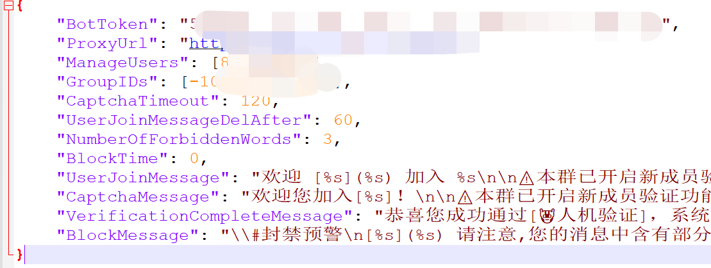

# csf-bot

辅助 ChineseSubFinder Telegram 群组的管理

如果有用户验证失败了，想要人工解禁，那么有一个方案：

由管理员给 bot 发送一条特点的字符串：

```
/set_one_time_pass_code 123haha
```

发送上面这段信息给 bot，`123haha`这个是特定临时密钥

会得到以下的反馈

```
找这个机器人 https://t.me/xxxxx 
进行对话
发送下面这段代码（注意有空格）：
 /manual_pass_verify 123haha
```

就可以解封了。但是需要注意的是，在 config.json 路径中，需要手动的添加群组 ID，你机器人覆盖了几个群组（）就要几个，解禁的时候也是一起解禁。

注意输入的是数组。



## Thank

[assimon/captcha-bot: 用于Telegram 加群验证机器人](https://github.com/assimon/captcha-bot)